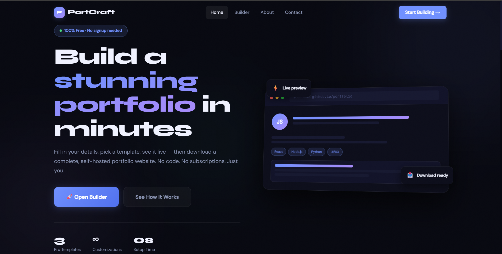

# 🚀 Portfolio Builder Website

A modern **Portfolio Builder Web App** that allows users to create their own portfolio websites with a live preview and download feature.

This project also includes a **multi-page website** with Home, About, Feedback, and Contact pages — making it feel like a real product.

---

## 🌐 Features

- 🧾 Portfolio Builder (form → live preview)
- 🎨 Multiple Templates 
- 🖼️ Profile Image Upload 
- ⚡ Live Preview 
- 📦 Download Portfolio as HTML
- 📱 Fully Responsive Design
- 🌐 Multi-page Website

---

## 🧰 Tech Stack

- HTML  
- CSS  
- JavaScript  

(No frameworks used)

---

## 📸 Screenshot

---

## 🚀 How to Use

1. Open the website  
2. Go to **Builder page**  
3. Fill in your details  
4. See live preview  
5. Click **Download** to get your portfolio  

---

## 💡 Future Improvements

- 💾 Save portfolios (local storage / database)
- 🌐 Shareable portfolio links
- 🎨 More templates
- 🔐 User authentication

---
## 🌐 Live Demo

🔗 [View Live Website]([https://your-username.github.io/your-repo-name](https://aryan4a.github.io/portcraft/index.html)/)

## 👨‍💻 Author

- Aryan Patil
- GitHub: https://github.com/Aryan4A  

---

## ⭐ Support

If you like this project, give it a ⭐ on GitHub!
